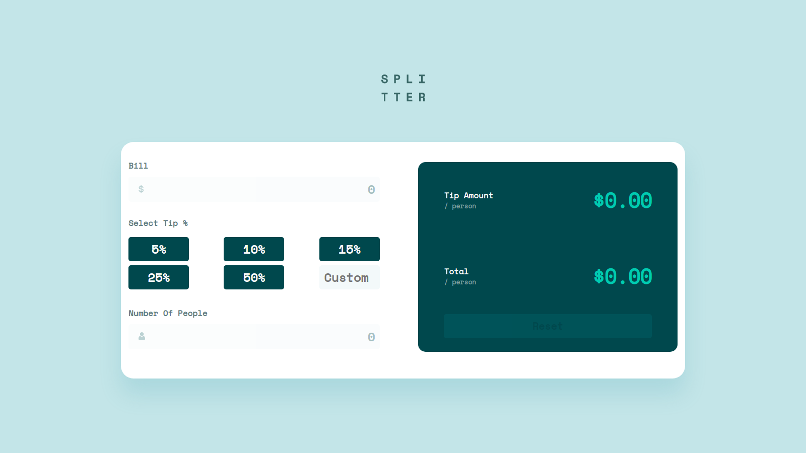

## Table of contents

- [Overview](#overview)
  - [The challenge](#the-challenge)
  - [Screenshot](#screenshot)
  - [Links](#links)
- [My process](#my-process)
  - [Built with](#built-with)
  - [What I learned](#what-i-learned)
- [Author](#author)

## Overview

### The challenge

Users should be able to:

- View the optimal layout for the app depending on their device's screen size
- See hover states for all interactive elements on the page
- Calculate the correct tip and total cost of the bill per person

### Screenshot

### Links

- Solution URL: [https://github.com/MuharemagiC/tip-calculator.git](https://github.com/MuharemagiC/tip-calculator.git)
- Live Site URL: [https://muharemagic.github.io/tip-calculator/](https://muharemagic.github.io/tip-calculator/)

## My process

### Built with

- Semantic HTML5 markup
- CSS custom properties
- Flexbox
- CSS Grid
- Mobile-first workflow
- [React](https://reactjs.org/) - JS library
- [TypeScript](https://www.typescriptlang.org/) - Programming Language
- [CSS Modules](https://github.com/css-modules/css-modules/)

### What I learned

I started learning typescript with react and I want to do some project with these technologies. Except TypeScript and React I implemented eslint and prittier rules with airbnb style. For styleing I tried to improve my skills in css modules.

### Continued development

For the future I want to improve my TypeScript, CSS and React skills. After it I will start learning new skills lik NextJS, GraphQL, NodeJS and more...

## Author

- Frontend Mentor - [@MuharemagiC](https://www.frontendmentor.io/profile/MuharemagiC)
